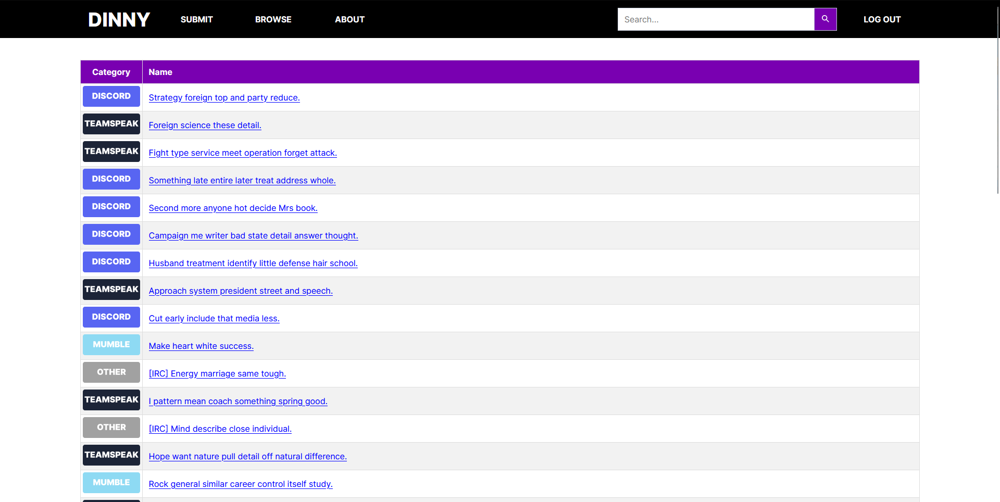
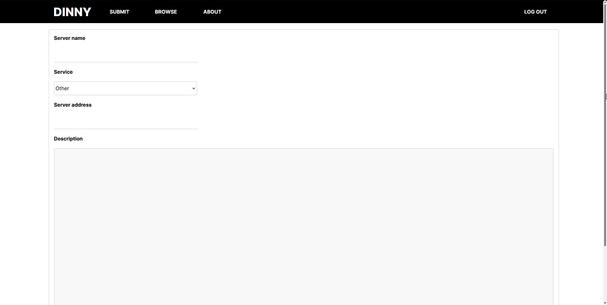
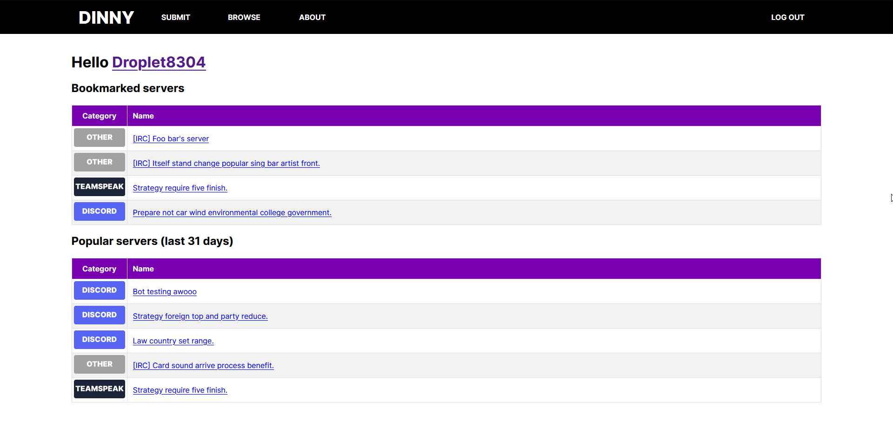
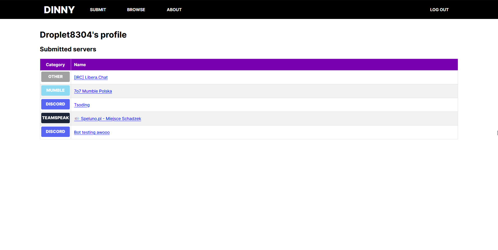
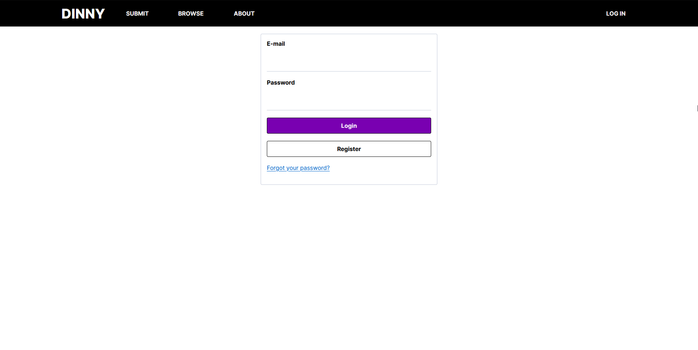
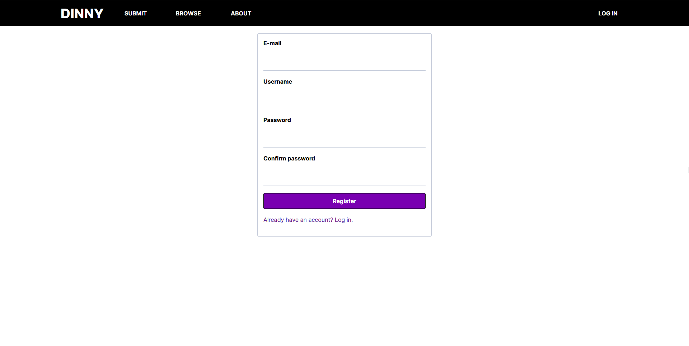
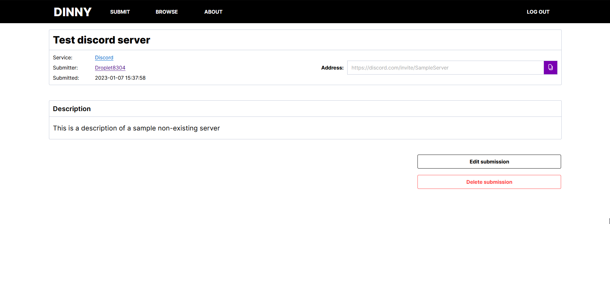

# Dinny

Place to advertise your chat servers.

## Table of contents

- [General info](#general-information)
- [Features](#features)
- [Technologies](#technologies)
- [Setup](#setup)
- [Status](#status)
- [Screenshots](#screenshots)

## General information

Dinny is a simple web app written in PHP. A board with popular chat services' servers (mostly voice chat) like [Discord](https://discord.com/), [TeamSpeak](https://teamspeak.com/) and [Mumble](https://www.mumble.com/). It provides simple features that you would expect from such service: user accounts, roles and permissions; editing and removing submissions; bookmarking servers; browsing popular servers.

## Features

- Easy to deploy
- Browsing submissions by pages
- User accounts (registration/logging in)
- User roles (user/admin)
- User permissions
  - User:
    - Can bookmark any server
    - Can edit/delete his own submissions
  - Admin:
    - Everything user can do
    - Delete other's submissions
- Search by title description or author
- Top N popular servers list in the last 31 days (by default 5 servers are displayed)
- Saving submissions for later
- Copy server address by pressing the button

## Technologies

Project is created with:
* HTML5
* CSS
* JavaScript (with AJAX)
* PHP
* PostgreSQL

## Setup
To run this project you need to install [docker](https://www.docker.com/).
1. Clone repository
2. Create ```.env``` file inside the cloned directory with the following variables:
```dotenv
DB_NAME=DATABASE_NAME
DB_USER=USERNAME
DB_PASSWORD=DATABASE_PASSWORD
DB_HOST=db
```
If you want to use local database set-up with docker, ```DB_HOST``` has to be set to ```db```. Adjust other variables to your liking.

3. Build the container
```
$ docker-compose build
```

4. Start the application
```
$ docker-compose up
```

## Status

This app will no longer be developed. No new features will come out, minor tweaks are expected.

## Screenshots







